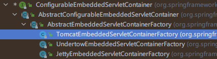

# Web开发

## 简介

使用SpringBoot；

**1）、创建SpringBoot应用，选中我们需要的模块；**

**2）、SpringBoot已经默认将这些场景配置好了，只需要在配置文件中指定少量配置就可以运行起来**

**3）、自己编写业务代码；**

**自动配置原理？**

这个场景SpringBoot帮我们配置了什么？能不能修改？能修改哪些配置？能不能扩展？

```
xxxxAutoConfiguration：帮我们给容器中自动[配置组件]；
xxxxProperties:[配置类]来[封装][配置文件]里的内容；
```

## SpringBoot对静态资源的映射规则

```
@ConfigurationProperties(prefix = "spring.resources", ignoreUnknownFields = false)
public class ResourceProperties implements ResourceLoaderAware {
// 可以设置和资源有关的参数、缓存时间等
```

```
public class WebMvcAutoConfiguration {

    @Override
    public void addResourceHandlers(ResourceHandlerRegistry registry) {

        if (!this.resourceProperties.isAddMappings()) {
            logger.debug("Default resource handling disabled");
            return;
        }
        
        // webjar资源映射
        Integer cachePeriod = this.resourceProperties.getCachePeriod();
        if (!registry.hasMappingForPattern("/webjars/**")) {
            customizeResourceHandlerRegistration(registry.addResourceHandler("/webjars/**")
                                                         .addResourceLocations("classpath:/META-INF/resources/webjars/")
                                                         .setCachePeriod(cachePeriod));
        }
        
        // 静态资源映射
        String staticPathPattern = this.mvcProperties.getStaticPathPattern();
        if (!registry.hasMappingForPattern(staticPathPattern)) {
            customizeResourceHandlerRegistration(registry.addResourceHandler(staticPathPattern)
                                                         .addResourceLocations(this.resourceProperties.getStaticLocations())
                                                         .setCachePeriod(cachePeriod));
        }
    }
    
    @Bean
    public WelcomePageHandlerMapping welcomePageHandlerMapping(ResourceProperties resourceProperties) {
        return new WelcomePageHandlerMapping(resourceProperties.getWelcomePage(),
                                             this.mvcProperties.getStaticPathPattern());
    }
    
    // 配置喜欢的图标
    @Configuration
    @ConditionalOnProperty(value = "spring.mvc.favicon.enabled", matchIfMissing = true)
    public static class FaviconConfiguration {

        private final ResourceProperties resourceProperties;

        public FaviconConfiguration(ResourceProperties resourceProperties) {
            this.resourceProperties = resourceProperties;
        }

        @Bean
        public SimpleUrlHandlerMapping faviconHandlerMapping() {
            SimpleUrlHandlerMapping mapping = new SimpleUrlHandlerMapping();
            mapping.setOrder(Ordered.HIGHEST_PRECEDENCE + 1);
            // 所有 **/favicon.ico
            mapping.setUrlMap(Collections.singletonMap("**/favicon.ico", faviconRequestHandler()));
            return mapping;
        }

        @Bean
        public ResourceHttpRequestHandler faviconRequestHandler() {
            ResourceHttpRequestHandler requestHandler = new ResourceHttpRequestHandler();
            requestHandler.setLocations(this.resourceProperties.getFaviconLocations());
            return requestHandler;
        }

    }
}
```

**1）、所有 `/webjars/**` ，都去 `classpath:/META-INF/resources/webjars/` 找资源；**

`webjars`：以jar包的方式引入静态资源；

http://www.webjars.org/

http://localhost:8080/webjars/jquery/3.6.0/jquery.js

```
<!‐‐引入jquery‐webjar‐‐>在访问的时候只需要写webjars下面资源的名称即可
<dependency>
    <groupId>org.webjars</groupId>
    <artifactId>jquery</artifactId>
    <version>3.6.0</version>
</dependency>
```

**2）、"/**" 访问当前项目的任何资源，如果没人处理，都去（静态资源文件夹）找映射**

```
"classpath:/META-INF/resources/",
"classpath:/resources/",
"classpath:/static/",
"classpath:/public/"
"/"：当前项目的根路径，java文件夹和resource文件夹都是类路径的根路径
```

`localhost:8080/abc` -> 去`静态资源文件夹`里面找abc

**3）、欢迎页； 静态资源文件夹下的所有index.html页面；被"/\*\*"映射；**

localhost:8080/ 找index页面

**4）、所有的 \*\*/favicon.ico 都是在静态资源文件下找；**

## 模板引擎

JSP、Velocity、Freemarker、Thymeleaf

Spring Boot推荐Thymeleaf

语法更简单，功能更强大

**1、引入thymeleaf**

```
<dependency>
    <groupId>org.springframework.boot</groupId>
    <artifactId>spring-boot-starter-thymeleaf</artifactId>
</dependency>

<!-- 切换thymeleaf的版本 -->
<properties>
    <thymeleaf.version>3.0.9.RELEASE</thymeleaf.version>
    <!-- 布局功能的支持程序 thymeleaf主程序为3.x时layout要用2以上版本 -->
    <!-- thymeleaf2 layout1 -->
    <!-- thymeleaf3 layout2 -->
    <thymeleaf-layout-dialect.version>2.1.1</thymeleaf-layout-dialect.version>
</properties>
```

**2、Thymeleaf使用**

```
@ConfigurationProperties(prefix = "spring.thymeleaf")
public class ThymeleafProperties {

	private static final Charset DEFAULT_ENCODING = Charset.forName("UTF-8");

	private static final MimeType DEFAULT_CONTENT_TYPE = MimeType.valueOf("text/html");

	public static final String DEFAULT_PREFIX = "classpath:/templates/";

	public static final String DEFAULT_SUFFIX = ".html";
	
	// 只要我们把HTML页面放在classpath:/templates/，thymeleaf就能自动渲染；
```

**使用：**

**1、导入thymeleaf的名称空间，开启语法提示**

```
<html lang="en" xmlns:th="http://www.thymeleaf.org">
```

**2、使用thymeleaf语法；**

```
<!DOCTYPE html>
<html lang="en" xmlns:th="http://www.thymeleaf.org">
<head>
    <meta charset="UTF‐8">
    <title>Title</title>
</head>
<body>
    <h1>成功！</h1>
    <!‐‐th:text 将div里面的文本内容设置为 ‐‐>
    <div th:text="${hello}">这是显示欢迎信息</div>
</body>
</html>
```

**3、语法规则**

1、th:text：改变当前元素里面的文本内容

th:任意html属性：来替换原生属性的值

| 顺序 | 特性                    | 属性                                                         |
| :--- | :---------------------- | :----------------------------------------------------------- |
| 1    | 包含片段（jsp:include） | `th:insert`<br />`th:replace`<br />`th:include`              |
| 2    | 迭代片段（c:forEach）   | `th:each`                                                    |
| 3    | 条件计算（c:if）        | `th:if`<br />`th:unless`<br />`th:switch`<br />`th:case`     |
| 4    | 局部变量定义（c:set）   | `th:object`<br />`th:with`                                   |
| 5    | 任意属性修改            | `th:attr`<br />`th:attrprepend`(前面追加)<br />`th:attrappend`(后面追加) |
| 6    | 具体属性修改            | `th:value`<br />`th:href`<br />`th:src`<br />`...`           |
| 7    | 修改标签体内容          | `th:text`(转义特殊字符)<br />`th:utext`(不转义特殊字符)      |
| 8    | 片段声明                | `th:fragment`                                                |
| 9    | 片段删除                | `th:remove`                                                  |

2、表达式

```
Simple expressions:（表达式语法）
    Variable Expressions: ${...} -> 获取变量值；OGNL
        1）获取对象的属性、调用方法
            ${person.father.name}
            ${person['father']['name']}
            ${countriesByCode.ES}
            ${personsByName['Stephen Zucchini'].age}
            ${personsArray[0].name}
            ${person.createCompleteName()}
            ${person.createCompleteNameWithSeparator('-')}
        2）使用内置的基本对象
            #ctx：                                上下文[对象]
                ${#ctx.locale}
                ${#ctx.variableNames}
                ${#ctx.request}
                ${#ctx.response}
                ${#ctx.session}
                ${#ctx.servletContext}
                param(这个是名称空间)
                    ${param.foo}                  // 使用请求参数 'foo' 的值检索 String[]
                    ${param.size()}
                    ${param.isEmpty()}
                    ${param.containsKey('foo')}
                    ...
                session(这个是名称空间)
                    ${session.foo}                // 检索 session 属性 'foo'
                    ${session.size()}
                    ${session.isEmpty()}
                    ${session.containsKey('foo')}
                    ...
                application(这个是名称空间)
                    ${application.foo}            // 检索 ServletContext 属性“foo”
                    ${application.size()}
                    ${application.isEmpty()}
                    ${application.containsKey('foo')}
                    ...
            #vars:                               上下文[变量]
            #locale：                            上下文[语言环境]
                ${#locale}
            在 Web 环境中，还可以直接访问以下对象（注意这些是对象，而不是映射/命名空间）：
            #request：                           （仅在 Web 上下文中）HttpServletRequest 对象
                ${#request.getAttribute('foo')}
                ${#request.getParameter('foo')}
                ${#request.getContextPath()}
                ${#request.getRequestName()}
                ...
            #response：                          （仅在 Web 上下文中）HttpServletResponse 对象
            #session：                           （仅在 Web 上下文中）HttpSession 对象
                ${#session.getAttribute('foo')}
                ${#session.id}
                ${#session.lastAccessedTime}
                ...
            #servletContext：                    （仅在 Web 上下文中）ServletContext 对象
                ${#servletContext.getAttribute('foo')}
                ${#servletContext.contextPath}
                ...
        3）内置的一些工具对象
            #execInfo:     有关正在处理的模板的信息。
            #messages:     在变量表达式中获取外部化消息的方法，与使用 #{…} 语法获取它们的方式相同。
            #uris:         转义部分 URL/URI 的方法
            #conversions:  执行配置的转换服务的方法（如果有的话）。
            #dates:        java.util.Date 对象的方法：格式化、组件提取等。
            #calendars:    类似于 #dates，但用于 java.util.Calendar 对象。
            #numbers:      格式化数字对象的方法。
            #strings:      String 对象的方法：contains、startsWith、prepending/appending 等。
            #objects:      对象的一般方法。
            #bools:        布尔判断的方法。
            #arrays:       数组的方法。
            #lists:        列表的方法。
            #sets:         集合的方法。
            #maps:         地图的方法。
            #aggregates:   在数组或集合上创建聚合的方法。
            #ids:          处理可能重复的 id 属性的方法（例如，作为迭代的结果）。
            
    Selection Variable Expressions: *{...} -> 选择表达式：和${}在功能上是一样
        补充：配合 th:object="${session.user}
        <div th:object="${session.user}">
            <p>Name: <span th:text="*{firstName}">Sebastian</span>.</p>
            <p>Surname: <span th:text="*{lastName}">Pepper</span>.</p>
            <p>Nationality: <span th:text="*{nationality}">Saturn</span>.</p>
        </div>
        
    Message Expressions: #{...} -> 获取国际化内容
    
    Link URL Expressions: @{...} -> 定义URL
        @{/order/process(execId=${execId}, execType='FAST')}
        
    Fragment Expressions: ~{...} -> 片段引用表达式
        <div th:insert="~{commons :: main}">...</div>
    
Literals:（字面量）
    Text literals: 'one text', 'Another one!',…
    Number literals: 0, 34, 3.0, 12.3,…
    Boolean literals: true, false
    Null literal: null
    Literal tokens: one, sometext, main,…
    
Text operations:（文本操作）
    String concatenation: +
    Literal substitutions: |The name is ${name}|
    
Arithmetic operations:（数学运算）
    Binary operators: +, -, *, /, %
    Minus sign (unary operator): -
    
Boolean operations:（布尔运算）
    Binary operators: and, or
    Boolean negation (unary operator): !, not
    
Comparisons and equality:（比较运算）
    Comparators: >, <, >=, <= (gt, lt, ge, le)
    Equality operators: ==, != (eq, ne)

Conditional operators:（条件运算）
    If-then: (if) ? (then)
    If-then-else: (if) ? (then) : (else)
    Default: (value) ?: (defaultvalue)

Special tokens:
    No-Operation: _
```

```
<!DOCTYPE html>
<html lang="en" xmlns:th="http://www.thymeleaf.org">
<head>
    <meta charset="UTF‐8">
    <title>Title</title>
</head>
    <body>
        <h1>成功！</h1>
        <!‐‐th:text 将div里面的文本内容设置为 ‐‐>
        <div id="div01" class="myDiv" th:id="${hello}" th:class="${hello}" th:text="${hello}">这是显示欢迎信息</div>

        <hr/>

        <div >[[${hello}]]</div><!-- th:text 转义特殊字符 -->
        <div >[(${hello})]</div><!-- th:utext 不转义特殊字符 -->

        <hr/>

        <!-- th:each 在那个标签上，那个标签就重复几次 -->
        <div th:each="user : ${users}" th:text="${user}"></div>
        <div>
            <span th:each="user : ${users}" th:text="${user}"></span>
        </div>
    </body>
</html>

```


## SpringMVC自动配置

### 1、Spring MVC auto-configuration

[Spring Boot Reference Guide](https://docs.spring.io/spring-boot/docs/1.5.9.RELEASE/reference/htmlsingle/#boot-features-spring-mvc)

### 27.1.1 Spring MVC auto-configuration

Spring Boot 自动配置好了SpringMVC

以下是SpringBoot对SpringMVC的默认配置:（`WebMvcAutoConfiguration`）

1. 包含`ContentNegotiatingViewResolver` 和 `BeanNameViewResolver` beans.
    - 自动配置了ViewResolver（视图解析器：根据方法的返回值得到视图对象（View），视图对象决定如何渲染（转发？重定向？））
    - `ContentNegotiatingViewResolver`：组合所有的视图解析器的；
    - 如何定制？：我们可以自己给容器中添加一个视图解析器；自动的将其组合进来；
2. 支持提供静态资源，包括对 WebJars 的支持（见下文）.静态资源文件夹路径，webjars
3. 自动注册了`Converter `, `GenericConverter `, `Formatter` beans.
    - Converter：转换器； public String hello(User user)：类型转换使用Converter
    - `Formatter `格式化器； 2017.12.17===Date；

```
@Bean
@ConditionalOnProperty(prefix = "spring.mvc", name = "date-format")    // 在文件中配置日期格式化的规则，如果配置了则注册此组件，否则不注册
public Formatter<Date> dateFormatter() {
    return new DateFormatter(this.mvcProperties.getDateFormat());      // 日期格式化组件
}
```

自己添加的格式化器转换器，我们只需要放在容器中即可

4. 支持 `HttpMessageConverters `(see below).
    - `HttpMessageConverter`：SpringMVC用来转换Http请求和响应的；User---Json；
    - `HttpMessageConverters `是从容器中确定；获取所有的`HttpMessageConverter`；
      自己给容器中添加`HttpMessageConverter`，只需要将自己的组件注册到容器中（@Bean、@Component）
5. 自动注册 `MessageCodesResolver `(see below).定义错误代码生成规则
6. 静态`index.html` 支持. 静态首页访问
7. 定制`Favicon`支持(see below). favicon.ico
8. 自动使用 `ConfigurableWebBindingInitializer `bean (see below).

我们可以配置一个`ConfigurableWebBindingInitializer`来替换默认的；（添加到容器）

  ```
初始化WebDataBinder；
请求数据=====JavaBean；
  ```


`org.springframework.boot.autoconfigure.web`：web的所有自动场景；

如果您想保留 SpringBoot MVC 功能，并且只想添加额外的 MVC 配置（拦截器、格式化程序、视图控制器等），您可以添加一个继承 `WebMvcConfigurerAdapter `类型的 `@Configuration` 类，但不要添加 `@EnableWebMvc`。

如果您希望提供 `RequestMappingHandlerMapping`、`RequestMappingHandlerAdapter `或 `ExceptionHandlerExceptionResolver `的自定义实例，您可以声明一个继承 `WebMvcRegistrationsAdapter ` 类的组件。

如果你想完全控制 Spring MVC，你可以添加一个带有 `@EnableWebMvc` 注解的 `@Configuration` 类。

### 2、扩展SpringMVC

```
<?xml version="1.0" encoding="UTF-8"?>
<beans xmlns="http://www.springframework.org/schema/beans"
       xmlns:xsi="http://www.w3.org/2001/XMLSchema-instance" xmlns:mvc="http://www.springframework.org/schema/mvc"
       xsi:schemaLocation="http://www.springframework.org/schema/beans http://www.springframework.org/schema/beans/spring-beans.xsd http://www.springframework.org/schema/mvc http://www.springframework.org/schema/mvc/spring-mvc.xsd">

    <mvc:view-controller path="/hello" view-name="success"/>
    <mvc:interceptors>
        <mvc:interceptor>
            <mvc:mapping path="/hello"/>
            <bean></bean>
        </mvc:interceptor>
    </mvc:interceptors>
    
</beans>
```

编写一个配置类（`@Configuration`），是`WebMvcConfigurerAdapter`类型；不能标注`@EnableWebMvc`;

既保留了所有的自动配置，也能用我们扩展的配置

```
// 使用WebMvcConfigurerAdapter可以来扩展SpringMVC的功能
// SpringBoot2 用这种方式 public class MyMvcConfig implements WebMvcConfigurer，因为SpringBoot2是基于Java8的，因此接口中用了default实现，不需要WebMvcConfigurerAdapter类了
@Configuration
public class MyMvcConfig extends WebMvcConfigurerAdapter {


    @Override
    public void addViewControllers(ViewControllerRegistry registry) {
        registry.addViewController("/fortunebill").setViewName("success");
    }
}
```

原理：

1. `WebMvcAutoConfigurationAdapter`是`SpringMVC`的自动配置类
2. 在做其他自动配置时会导入；`@Import(EnableWebMvcConfiguration.class)`

```
@Configuration
@Import(EnableWebMvcConfiguration.class)
@EnableConfigurationProperties({ WebMvcProperties.class, ResourceProperties.class })
public static class WebMvcAutoConfigurationAdapter extends WebMvcConfigurerAdapter {
}

@Configuration
public static class EnableWebMvcConfiguration extends DelegatingWebMvcConfiguration {

}

@Configuration
public class DelegatingWebMvcConfiguration extends WebMvcConfigurationSupport {

	private final WebMvcConfigurerComposite configurers = new WebMvcConfigurerComposite();

    // 从容器中获取所有的 WebMvcConfigurer
	@Autowired(required = false)
	public void setConfigurers(List<WebMvcConfigurer> configurers) {
		if (!CollectionUtils.isEmpty(configurers)) {
			this.configurers.addWebMvcConfigurers(configurers);
		}
	}
	
	@Override
	protected void addViewControllers(ViewControllerRegistry registry) {
		this.configurers.addViewControllers(registry);
	}
	
	// configurers对象里的实现方法，将所有的WebMvcConfigurer相关配置都来一起调用
	// @Override
	// public void addViewControllers(ViewControllerRegistry registry) {
	// 	for (WebMvcConfigurer delegate : this.delegates) {
	// 		delegate.addViewControllers(registry);
	// 	}
	// }
}
```

3. 容器中所有的WebMvcConfigurer都会一起起作用
4. 我们的配置类也会被调用

效果：SpringMVC的自动配置和我们的扩展配置都会起作用；

### 3、全面接管SpringMVC

SpringBoot对SpringMVC的自动配置不需要了，所有都是我们自己配；所有的SpringMVC的自动配置都失效了

**我们需要在配置类中添加@EnableWebMvc即可**

原理：

	为什么添加了`@EnableWebMvc`，自动配置就失效了？

1. `@EnableWebMvc`注解的核心

```
@Import({DelegatingWebMvcConfiguration.class})
public @interface EnableWebMvc {
```

2.

```
@Configuration
public class DelegatingWebMvcConfiguration extends WebMvcConfigurationSupport {
```

3.

```
@Configuration
@ConditionalOnWebApplication
@ConditionalOnClass({ Servlet.class, DispatcherServlet.class, WebMvcConfigurerAdapter.class })
// 容器中没有这个组件的时候，这个自动配置类才生效
@ConditionalOnMissingBean(WebMvcConfigurationSupport.class)
@AutoConfigureOrder(Ordered.HIGHEST_PRECEDENCE + 10)
@AutoConfigureAfter({ DispatcherServletAutoConfiguration.class, ValidationAutoConfiguration.class })
public class WebMvcAutoConfiguration {
```

4. `@EnableWebMvc`将`WebMvcConfigurationSupport`组件导入进来
5. 导入的`WebMvcConfigurationSupport`只是`SpringMVC`最基本的功能

## 如何修改SpringBoot的默认配置

模式

1、Spring Boot在自动配置很多组件的时候，先看容器中有没有用户配置的（@Bean、@Component）如果有就用用户配置的，如果没有，才自动配置。

    如果有些组件可以有多个（例如：ViewResolver），SpringBoot会将用户配置的和SpringBoot默认的组合起来。

2、在SpringBoot中会有非常多的xxxConfigurer帮助我们进行扩展配置

3、在SpringBoot中会有很多的xxxCustomizer帮助我们进行定制配置

## RestfulCRUD

### 1、默认访问首页

```
// 使用WebMvcConfigurerAdapter可以来扩展SpringMVC的功能
// @EnableWebMvc   不要接管SpringMVC
@Configuration
public class MyMvcConfig extends WebMvcConfigurerAdapter {

    @Override
    public void addViewControllers(ViewControllerRegistry registry) {
        // 浏览器发送 /fortunebill 请求来到 success
        registry.addViewController("/fortunebill").setViewName("success");
        // 设置登录页面
        registry.addViewController("/").setViewName("login");
        registry.addViewController("/index.html").setViewName("login");
    }
}
```

### 2、国际化

过去使用SpringMVC时的步骤

1. 编写国际化配置文件
2. 使用ResourceBundleMessageSource管理国际化资源文件
3. 在页面使用fmt:message取出国际化内容

使用SpringBoot的步骤

1. 编写国际化配置文件，抽取页面需要显示的国际化消息

```
login.properties
login.password=密码
login.remember_me=记住我
login.sign_in=注册
login.tip=登录
login.username=用户名

login_en_US.properties
login.password=Password
login.remember_me=remember-me
login.sign_in=Sign in
login.tip=Please sign in
login.username=Username


login_zh_CN.properties
login.password=密码
login.remember_me=记住我
login.sign_in=注册
login.tip=登录
login.username=用户名
```

2. SpringBoot自动配置好了管理国际化资源文件的组件

```
@ConfigurationProperties(prefix = "spring.messages")
public class MessageSourceAutoConfiguration {
    
    /**
     * Comma-separated list of basenames (essentially a fully-qualified classpath
     * location), each following the ResourceBundle convention with relaxed support for
     * slash based locations. If it doesn't contain a package qualifier (such as
     * "org.mypackage"), it will be resolved from the classpath root.
     */
    private String basename = "messages";  
    // 我们的配置文件可以直接放在类路径下叫messages.properties；
    
    @Bean
    public MessageSource messageSource() {
        ResourceBundleMessageSource messageSource = new ResourceBundleMessageSource();
        if (StringUtils.hasText(this.basename)) {
            // 设置国际化资源文件的基础名（去掉语言国家代码的）
            messageSource.setBasenames(StringUtils.commaDelimitedListToStringArray(
                    StringUtils.trimAllWhitespace(this.basename)));
        }
        if (this.encoding != null) {
            messageSource.setDefaultEncoding(this.encoding.name());
        }
        messageSource.setFallbackToSystemLocale(this.fallbackToSystemLocale);
        messageSource.setCacheSeconds(this.cacheSeconds);
        messageSource.setAlwaysUseMessageFormat(this.alwaysUseMessageFormat);
        return messageSource;
    }
```

3. 去页面获取国际化的值

```
spring.messages.basename=i18n/login
```

```
<!DOCTYPE html>
<html lang="en" xmlns:th="http://www.thymeleaf.org">
	<head>
		<meta http-equiv="Content-Type" content="text/html; charset=UTF-8">
		<meta name="viewport" content="width=device-width, initial-scale=1, shrink-to-fit=no">
		<meta name="description" content="">
		<meta name="author" content="">
		<title>Signin Template for Bootstrap</title>
		<!-- Bootstrap core CSS -->
		<link href="asserts/css/bootstrap.min.css" th:href="@{/webjars/bootstrap/4.0.0/css/bootstrap.min.css}" rel="stylesheet">
		<!-- Custom styles for this template -->
		<link href="asserts/css/signin.css" th:href="@{/asserts/css/signin.css}" rel="stylesheet">
	</head>

	<body class="text-center">
		<form class="form-signin" action="dashboard.html">
			
			<h1 class="h3 mb-3 font-weight-normal" th:text="#{login.tip}"></h1>
			<label class="sr-only">Username</label>
			<input type="text" class="form-control" placeholder="Username" th:placeholder="#{login.username}" required="" autofocus="">
			<label class="sr-only">Password</label>
			<input type="password" class="form-control" placeholder="Password" th:placeholder="#{login.password}" required="">
			<div class="checkbox mb-3">
				<label>
          <input type="checkbox" value="remember-me">[[#{login.remember_me}]]
        </label>
			</div>
			<button class="btn btn-lg btn-primary btn-block" type="submit" th:text="#{login.sign_in}">Sign in</button>
			<p class="mt-5 mb-3 text-muted">© 2017-2018</p>
			<a class="btn btn-sm">中文</a>
			<a class="btn btn-sm">English</a>
		</form>

	</body>

</html>
```

效果：根据浏览器语言设置的信息切换了国际化

原理：

	国际化Locale（区域信息对象）；LocaleResolver（获取区域信息对象）；

```
@Bean
@ConditionalOnMissingBean
@ConditionalOnProperty(prefix = "spring.mvc", name = "locale")
public LocaleResolver localeResolver() {
  if (this.mvcProperties.getLocaleResolver() == WebMvcProperties.LocaleResolver.FIXED) {
    return new FixedLocaleResolver(this.mvcProperties.getLocale());
  }
  AcceptHeaderLocaleResolver localeResolver = new AcceptHeaderLocaleResolver();
  localeResolver.setDefaultLocale(this.mvcProperties.getLocale());
  return localeResolver;
}
默认的就是根据请求头带来的区域信息获取Locale进行国际化
```

4. 点击链接切换国际化

```
<a class="btn btn-sm" th:href="@{/index.html(l='zh_CN')}">中文</a>
<a class="btn btn-sm" th:href="@{/index.html(l='en_US')}">English</a>

/**
 * 可以在连接上携带区域信息
 */
public class MyLocaleResolver implements LocaleResolver {
    
    @Override
    public Locale resolveLocale(HttpServletRequest request) {
        String l = request.getParameter("l");
        Locale locale = Locale.getDefault();
        if(!StringUtils.isEmpty(l)){
            String[] split = l.split("_");
            locale = new Locale(split[0],split[1]);
        }
        return locale;
    }

    @Override
    public void setLocale(HttpServletRequest request, HttpServletResponse response, Locale locale) {

    }
}

@Bean
public LocaleResolver localeResolver(){
    return new MyLocaleResolver();
}
```

### 3、登陆

开发期间模板引擎页面修改以后，要实时生效

1. 禁用模板引擎的缓存

```
# 禁用缓存
spring.thymeleaf.cache=false 
```

2. 页面修改完成以后ctrl+f9：重新编译；

登陆错误消息的显示

```
<p style="color: red" th:text="${msg}" th:if="${not #strings.isEmpty(msg)}"></p>
```


### 4、拦截器进行登陆检查

拦截器

```
/**
 * 登录检查
 */
public class LoginHandlerInterceptor implements HandlerInterceptor {

    @Override
    public boolean preHandle(HttpServletRequest request, HttpServletResponse response, Object handler) throws Exception {
        Object loginUser = request.getSession().getAttribute("loginUser");
        if (loginUser == null) {
            request.setAttribute("msg", "当前没有权限，请登录");
            request.getRequestDispatcher("/index.html").forward(request, response);
            return false;
        }
        return true;
    }

    @Override
    public void postHandle(HttpServletRequest request, HttpServletResponse response, Object handler, ModelAndView modelAndView) throws Exception {

    }

    @Override
    public void afterCompletion(HttpServletRequest request, HttpServletResponse response, Object handler, Exception ex) throws Exception {

    }
}

```

注册拦截器

```
/**
 * Spring Boot 配置文件
 */
@Configuration
public class MyMvcConfig extends WebMvcConfigurerAdapter {

    @Override
    public void addInterceptors(InterceptorRegistry registry) {
        registry.addInterceptor(new LoginHandlerInterceptor())
                // 该拦截器拦截所有请求
                // 对于静态资源：*.css , *.js等，SpringBoot已经做好了静态资源映射
                .addPathPatterns("/**")
                // 排除以下请求
                .excludePathPatterns("/")             // 主页跳转
                .excludePathPatterns("/index.html")   // 主页跳转
                .excludePathPatterns("/user/login");  // 登录请求
    }
}
```

### 5、CRUD-员工列表

实验要求：

1. **RestfulCRUD：CRUD满足Rest风格**

URI：/资源名称/资源标识  ->  HTTP请求方式区分对资源CRUD操作

|      | 普通CRUD（uri来区分操作） | RestfulCRUD       |
| ---- | ------------------------- | ----------------- |
| 查询 | getEmp                    | emp---GET         |
| 添加 | addEmp?xxx                | emp---POST        |
| 修改 | updateEmp?id=xxx&xxx=xx   | emp/{id}---PUT    |
| 删除 | deleteEmp?id=1            | emp/{id}---DELETE |

2. **实验的请求架构**

| 实验功能                             | 请求URI | 请求方式 |
| ------------------------------------ | ------- | -------- |
| 查询所有员工                         | emps    | GET      |
| 查询某个员工(来到修改页面)           | emp/1   | GET      |
| 来到添加页面                         | emp     | GET      |
| 添加员工                             | emp     | POST     |
| 来到修改页面（查出员工进行信息回显） | emp/1   | GET      |
| 修改员工                             | emp     | PUT      |
| 删除员工                             | emp/1   | DELETE   |

2. **员工列表**

thymeleaf公共页面元素抽取

```
1、抽取公共片段
<div th:fragment="copy">
    &copy; 2011 The Good Thymes Virtual Grocery
</div>

2、引入公共片段
<div th:insert="~{footer :: copy}"></div>
~{templatename::selector}：模板名::选择器
~{templatename::fragmentname}:模板名::片段名

3、默认效果：
insert的公共片段在div标签中
如果使用th:insert等属性进行引入，可以不用写~{}：
行内写法可以加上：[[~{}]];[(~{})]；
```

3. **三种引入公共片段的th属性**

**th:insert**：将公共片段整个插入到声明引入的元素中

**th:replace**：将声明引入的元素替换为公共片段

**th:include**：将被引入的片段的内容包含进这个标签中

```
<footer th:fragment="copy">
    &copy; 2011 The Good Thymes Virtual Grocery
</footer>

<!--引入方式-->
<div th:insert="footer :: copy"></div>
<div th:replace="footer :: copy"></div>
<div th:include="footer :: copy"></div>

<!-- insert 效果-->
<div>
    <footer>
        &copy; 2011 The Good Thymes Virtual Grocery
    </footer>
</div>

<!-- replace 效果-->
<footer>
    &copy; 2011 The Good Thymes Virtual Grocery
</footer>

<!-- include 效果-->
<div>
    &copy; 2011 The Good Thymes Virtual Grocery
</div>
```

4. **引入片段的时候传入参数**

```
<nav class="col-md-2 d-none d-md-block bg-light sidebar" id="sidebar">
    <div class="sidebar-sticky">
        <ul class="nav flex-column">
            <li class="nav-item">
                <a class="nav-link active"
                   th:class="${activeUri=='main.html'?'nav-link active':'nav-link'}"
                   href="#" th:href="@{/main.html}">
                    <svg xmlns="http://www.w3.org/2000/svg" width="24" height="24" viewBox="0 0 24 24" fill="none"
                         stroke="currentColor" stroke-width="2" stroke-linecap="round" stroke-linejoin="round"
                         class="feather feather-home">
                        <path d="M3 9l9-7 9 7v11a2 2 0 0 1-2 2H5a2 2 0 0 1-2-2z"></path>
                        <polyline points="9 22 9 12 15 12 15 22"></polyline>
                    </svg>
                    Dashboard <span class="sr-only">(current)</span>
                </a>
            </li>

<!--引入侧边栏时传入参数-->
<div th:replace="commons/bar::#sidebar(activeUri='emps')"></div>
```

### 6、CRUD-员工添加

添加页面

```
<form th:action="@{/emp}" method="post">
    <div class="form-group">
        <label>LastName</label>
        <input type="text" name="lastName" class="form-control" placeholder="zhangsan">
    </div>
    <div class="form-group">
        <label>Email</label>
        <input type="email" name="email" class="form-control" placeholder="zhangsan@atguigu.com">
    </div>
    <div class="form-group">
        <label>Gender</label><br/>
        <div class="form-check form-check-inline">
            <input class="form-check-input" type="radio" name="gender"  value="1">
            <label class="form-check-label">男</label>
        </div>
        <div class="form-check form-check-inline">
            <input class="form-check-input" type="radio" name="gender"  value="0">
            <label class="form-check-label">女</label>
        </div>
    </div>
    <div class="form-group">
        <label>department</label>
        <select class="form-control" name="department.id">
            <!-- 提交的是部门的id -->
            <option th:each="dept : ${depts}" th:value="*{dept.id}" th:text="*{dept.departmentName}"></option>
        </select>
    </div>
    <div class="form-group">
        <label>Birth</label>
        <input type="text" name="birth" class="form-control" placeholder="zhangsan">
    </div>
    <button type="submit" class="btn btn-primary">添加</button>
</form>
```

提交的数据格式不对：生日：日期

2021-11-15；2021/11/15；2021.11.15

日期的格式化：SpringMVC将页面提交的值转换为指定的类型

2021-11-15 -> Date:类型转换，格式化

默认日期是按照/的方式

### 7、CRUD-员工修改

修改添加二合一表单

```
<!-- 需要区分员工是修改还是添加 -->
<form th:action="@{/emp}" method="post">
    <!--发送put请求修改员工数据-->
    <!--
        1、SpringMVC中配置HiddenHttpMethodFilter;（SpringBoot自动配置好的）
        2、页面创建一个post表单
        3、创建一个input项，type="hidden";name="_method";value 就是我们指定的请求方式
    -->
    <input type="hidden" name="_method" value="put" th:if="${emp != null}">
    <input type="hidden" name="id" th:value="${emp.id}" th:if="${emp != null}">
    <div class="form-group">
        <label>LastName</label>
        <input type="text" name="lastName" class="form-control" placeholder="zhangsan" th:value="${emp != null} ? ${emp.lastName}">
    </div>
    <div class="form-group">
        <label>Email</label>
        <input type="email" name="email" class="form-control" placeholder="zhangsan@atguigu.com" th:value="${emp != null} ? ${emp.email}">
    </div>
    <div class="form-group">
        <label>Gender</label><br/>
        <div class="form-check form-check-inline">
            <input class="form-check-input" type="radio" name="gender"  value="1" th:checked="${emp != null} ? ${emp.gender == 1}">
            <label class="form-check-label">男</label>
        </div>
        <div class="form-check form-check-inline">
            <input class="form-check-input" type="radio" name="gender"  value="0" th:checked="${emp != null} ? ${emp.gender == 0}">
            <label class="form-check-label">女</label>
        </div>
    </div>
    <div class="form-group">
        <label>department</label>
        <select class="form-control" name="department.id">
            <!-- 提交的是部门的id -->
            <option th:each="dept : ${depts}" th:value="*{dept.id}" th:text="*{dept.departmentName}"
                    th:selected="${emp != null} ? ${emp.department.id == dept.id}"></option>
        </select>
    </div>
    <div class="form-group">
        <label>Birth</label>
        <input type="text" name="birth" class="form-control" placeholder="zhangsan" th:value="${emp != null} ? ${#dates.format(emp.birth, 'yyyy-MM-dd')}">
    </div>
    <button type="submit" class="btn btn-primary" th:text="${emp != null} ? '修改' : '添加'">添加</button>
</form>
```

### 8、CRUD-员工删除

```
<tr th:each="emp : ${emps}">
    <td th:text="*{emp.id}"></td>
    <td >[[${emp.lastName}]]</td>
    <td th:text="${emp.email}"></td>
    <td th:text="${emp.gender} == 0 ? '女' : '男'"></td>
    <td th:text="${emp.department.departmentName}"></td>
    <td th:text="${#dates.format(emp.birth, 'yyyy-MM-dd')}"></td>
    <td>
        <a class="btn btn-sm btn-primary" th:href="@{/emp/}+${emp.id}">编辑</a>
        <button th:attr="delete_uri=@{/emp/}+${emp.id}" type="submit" class="btn btn-sm btn-danger deleteBtn">删除</button>
    </td>
</tr>
```


## 错误处理机制

### 1、SpringBoot默认的错误处理机制

默认效果：

1. 浏览器，返回一个默认的错误页面
2. 如果是其他客户端，默认响应一个json数据

原理：

可以参照ErrorMvcAutoConfiguration，错误处理的自动配置，给容器中添加了以下组件

1. DefaultErrorAttributes

```
@Override
public Map<String, Object> getErrorAttributes(RequestAttributes requestAttributes, boolean includeStackTrace) {
    Map<String, Object> errorAttributes = new LinkedHashMap<>();
    errorAttributes.put("timestamp", new Date());
    addStatus(errorAttributes, requestAttributes);
    addErrorDetails(errorAttributes, requestAttributes, includeStackTrace);
    addPath(errorAttributes, requestAttributes);
    return errorAttributes;
}
```

2. BasicErrorController：处理默认/error请求

```
@Controller
@RequestMapping("${server.error.path:${error.path:/error}}")
public class BasicErrorController extends AbstractErrorController {

    @RequestMapping(produces = "text/html")//产生html类型的数据；浏览器发送的请求来到这个方法处理
    public ModelAndView errorHtml(HttpServletRequest request, HttpServletResponse response) {
        HttpStatus status = getStatus(request);
        Map<String, Object> model = Collections.unmodifiableMap(getErrorAttributes(request, isIncludeStackTrace(request, MediaType.TEXT_HTML)));
        response.setStatus(status.value());

        //去哪个页面作为错误页面；包含页面地址和页面内容
        ModelAndView modelAndView = resolveErrorView(request, response, status, model);
        return (modelAndView == null ? new ModelAndView("error", model) : modelAndView);
    }

    @RequestMapping
    @ResponseBody    //产生json数据，其他客户端来到这个方法处理；
    public ResponseEntity<Map<String, Object>> error(HttpServletRequest request) {
        Map<String, Object> body = getErrorAttributes(request, isIncludeStackTrace(request, MediaType.ALL));
        HttpStatus status = getStatus(request);
        return new ResponseEntity<>(body, status);
    }
}
```

3. ErrorPageCustomizer

```
@Value("${error.path:/error}")
private String path = "/error";  系统出现错误以后来到error请求进行处理；（web.xml注册的错误页面规则）
```

4. DefaultErrorViewResolver

```
@Override
public ModelAndView resolveErrorView(HttpServletRequest request, HttpStatus status, Map<String, Object> model) {
    ModelAndView modelAndView = resolve(String.valueOf(status), model);
    if (modelAndView == null && SERIES_VIEWS.containsKey(status.series())) {
        modelAndView = resolve(SERIES_VIEWS.get(status.series()), model);
    }
    return modelAndView;
}

private ModelAndView resolve(String viewName, Map<String, Object> model) {
    //默认SpringBoot可以去找到一个页面？  error/404
    String errorViewName = "error/" + viewName;

    //模板引擎可以解析这个页面地址就用模板引擎解析
    TemplateAvailabilityProvider provider = this.templateAvailabilityProviders.getProvider(errorViewName, this.applicationContext);
    if (provider != null) {
        //模板引擎可用的情况下返回到errorViewName指定的视图地址
        return new ModelAndView(errorViewName, model);
    }
    //模板引擎不可用，就在静态资源文件夹下找errorViewName对应的页面   error/404.html
    return resolveResource(errorViewName, model);
}
```

步骤：

一但系统出现4xx或者5xx之类的错误；ErrorPageCustomizer就会生效（定制错误的响应规则）；就会来到/error请求；就会被**BasicErrorController**处理；

1. 响应页面；去哪个页面是由**DefaultErrorViewResolver**解析得到的；

```
protected ModelAndView resolveErrorView(HttpServletRequest request, HttpServletResponse response, HttpStatus status, Map<String, Object> model) {
    //所有的ErrorViewResolver得到ModelAndView
   for (ErrorViewResolver resolver : this.errorViewResolvers) {
      ModelAndView modelAndView = resolver.resolveErrorView(request, status, model);
      if (modelAndView != null) {
         return modelAndView;
      }
   }
   return null;
}
```

### 2、如何定制错误响应

#### 	1、如何定制错误的页面

1. **有模板引擎的情况下**；/templates/error/状态码; 【将错误页面命名为  错误状态码.html 放在模板引擎文件夹里面的 error文件夹下】，发生此状态码的错误就会来到  对应的页面；

```
我们可以使用4xx和5xx作为错误页面的文件名来匹配这种类型的所有错误，精确优先（优先寻找精确的状态码.html）；
页面能获取的信息；
timestamp：时间戳
status：状态码
error：错误提示
exception：异常对象
message：异常消息
errors：JSR303数据校验的错误都在这里
```

2. 没有模板引擎（**模板引擎找不到这个错误页面**），静态资源文件夹下找；
3. 以上都没有错误页面，就是**默认来到SpringBoot默认的错误提示页面**；

#### 	2、如何定制错误的json数据

1. 自定义异常处理&返回定制json数据

```
@ControllerAdvice
public class MyExceptionHandler {

    @ResponseBody
    @ExceptionHandler(UserNotExistException.class)
    public Map<String,Object> handleException(Exception e){
        Map<String,Object> map = new HashMap<>();
        map.put("code","user.notexist");
        map.put("message",e.getMessage());
        return map;
    }
}
//没有自适应效果...
```

2. 转发到/error进行自适应响应效果处理

```
@ExceptionHandler(UserNotExistException.class)
public String handleException(Exception e, HttpServletRequest request){
    Map<String,Object> map = new HashMap<>();
    //传入我们自己的错误状态码  4xx 5xx，否则就不会进入定制错误页面的解析流程
    /**
     * Integer statusCode = (Integer) request.getAttribute("javax.servlet.error.status_code");
     */
    request.setAttribute("javax.servlet.error.status_code",500);
    map.put("code","user.notexist");
    map.put("message",e.getMessage());
    //转发到/error
    return "forward:/error";
}
```


#### 	3、将我们的定制数据携带出去

出现错误以后，会来到/error请求，会被BasicErrorController处理，响应出去可以获取的数据是由getErrorAttributes得到的(是AbstractErrorController(ErrorController)规定的方法)；

1. 我们来编写一个ErrorController的实现类【或者是编写AbstractErrorController的子类】，放在容器中；

2. 页面上能用的数据，或者是json返回能用的数据都是通过ErrorAttributes.getErrorAttributes得到；

​	容器中DefaultErrorAttributes.getErrorAttributes()；默认进行数据处理的；

自定义ErrorAttributes

```
//给容器中加入我们自己定义的ErrorAttributes
@Component
public class MyErrorAttributes extends DefaultErrorAttributes {

    @Override
    public Map<String, Object> getErrorAttributes(RequestAttributes requestAttributes, boolean includeStackTrace) {
        Map<String, Object> map = super.getErrorAttributes(requestAttributes, includeStackTrace);
        map.put("company","atguigu");
        return map;
    }
}
```

**最终的效果**：响应是自适应的，可以通过定制ErrorAttributes改变需要返回的内容

## 配置嵌入式Servlet容器

SpringBoot默认使用Tomcat作为嵌入式的Servlet容器；

问题？

### 1、如何定制和修改Servlet容器的相关配置

1. 修改和server有关的配置（ServerProperties【也是EmbeddedServletContainerCustomizer】）

```
server.port=8081
server.context-path=/crud

server.tomcat.uri-encoding=UTF-8

//通用的Servlet容器设置
server.xxx
//Tomcat的设置
server.tomcat.xxx
```

2. 编写一个**EmbeddedServletContainerCustomizer**：嵌入式的Servlet容器的定制器；来修改Servlet容器的配置

```
@Bean  //一定要将这个定制器加入到容器中
public EmbeddedServletContainerCustomizer embeddedServletContainerCustomizer(){
    return new EmbeddedServletContainerCustomizer() {

        //定制嵌入式的Servlet容器相关的规则
        @Override
        public void customize(ConfigurableEmbeddedServletContainer container) {
            container.setPort(8083);
        }
    };
}
```


### 2、注册Servlet三大组件【Servlet、Filter、Listener】

由于SpringBoot默认是以jar包的方式启动嵌入式的Servlet容器来启动SpringBoot的web应用，没有web.xml文件。

注册三大组件用以下方式

**Servlet**RegistrationBean

```
@Bean
public ServletRegistrationBean myServlet() {
    ServletRegistrationBean registrationBean = new ServletRegistrationBean(new MyServlet(), "/myServlet");
    return registrationBean;
}
```

**Filter**RegistrationBean

```
@Bean
public FilterRegistrationBean myFilter(ServletRegistrationBean myServlet) {
    // FilterRegistrationBean registrationBean = new FilterRegistrationBean(new MyFilter(), myServlet);
    FilterRegistrationBean registrationBean = new FilterRegistrationBean();
    registrationBean.setFilter(new MyFilter());
    registrationBean.setUrlPatterns(Arrays.asList("/myFilter","/hello"));
    return registrationBean;
}
```

**ServletListener**RegistrationBean

```
@Bean
public ServletListenerRegistrationBean<MyListener> myListener() {
    ServletListenerRegistrationBean<MyListener> registrationBean = new ServletListenerRegistrationBean<>(new MyListener());
    return registrationBean;
}
```

SpringBoot帮我们自动SpringMVC的时候，自动的注册SpringMVC的前端控制器；DispatcherServlet；

DispatcherServletAutoConfiguration中：

```
@Bean(name = DEFAULT_DISPATCHER_SERVLET_REGISTRATION_BEAN_NAME)
@ConditionalOnBean(value = DispatcherServlet.class, name = DEFAULT_DISPATCHER_SERVLET_BEAN_NAME)
public ServletRegistrationBean dispatcherServletRegistration(DispatcherServlet dispatcherServlet) {
    
    ServletRegistrationBean registration = new ServletRegistrationBean(dispatcherServlet, this.serverProperties.getServletMapping());
    // 默认拦截： /  所有请求；包扩静态资源，但是不拦截jsp请求；   /*会拦截jsp
    // 可以通过server.servletPath来修改SpringMVC前端控制器默认拦截的请求路径
    
    registration.setName(DEFAULT_DISPATCHER_SERVLET_BEAN_NAME);
    registration.setLoadOnStartup(this.webMvcProperties.getServlet().getLoadOnStartup());
    
    if (this.multipartConfig != null) {
        registration.setMultipartConfig(this.multipartConfig);
    }
    return registration;
}
```


**SpringBoot能不能支持其他的Servlet容器？**

### 3、替换为其他嵌入式Servlet容器



默认支持

Tomcat（默认使用）

```
<dependency>
    <!-- 引入web时默认引用的就是tomcat作为web容器的 -->
    <groupId>org.springframework.boot</groupId>
    <artifactId>spring-boot-starter-web</artifactId>
</dependency>
```

UnderTow

```
<dependency>
    <groupId>org.springframework.boot</groupId>
    <artifactId>spring-boot-starter-web</artifactId>
    <exclusions>
        <exclusion>
            <groupId>org.springframework.boot</groupId>
            <artifactId>spring-boot-starter-tomcat</artifactId>
        </exclusion>
    </exclusions>
</dependency>

<!-- 引入其他Servlet容器 -->
<dependency>
    <groupId>org.springframework.boot</groupId>
    <artifactId>spring-boot-starter-undertow</artifactId>
</dependency>
```

Jetty

```
<dependency>
    <groupId>org.springframework.boot</groupId>
    <artifactId>spring-boot-starter-web</artifactId>
    <exclusions>
        <exclusion>
            <groupId>org.springframework.boot</groupId>
            <artifactId>spring-boot-starter-tomcat</artifactId>
        </exclusion>
    </exclusions>
</dependency>

<!-- 引入其他Servlet容器 -->
<dependency>
    <groupId>org.springframework.boot</groupId>
    <artifactId>spring-boot-starter-jetty</artifactId>
</dependency>
```

### 4、嵌入式Servlet容器自动配置原理

**EmbeddedServletContainer**AutoConfiguration：嵌入式的Servlet容器自动配置？

```
@AutoConfigureOrder(Ordered.HIGHEST_PRECEDENCE)
@Configuration
@ConditionalOnWebApplication
@Import(BeanPostProcessorsRegistrar.class)
// 导入BeanPostProcessorsRegistrar：Spring注解版；给容器中导入一些组件
// 导入了EmbeddedServletContainerCustomizerBeanPostProcessor：
// 后置处理器：bean初始化前后（创建完对象，还没赋值赋值）执行初始化工作
public class EmbeddedServletContainerAutoConfiguration {
    
    @Configuration
    // ↓ 判断当前是否引入了Tomcat依赖
    @ConditionalOnClass({ Servlet.class, Tomcat.class })
    // ↓ 判断当前容器没有用户自己定义EmbeddedServletContainerFactory(嵌入式的Servlet容器工厂)
    // ↓ 作用：创建嵌入式的Servlet容器
    @ConditionalOnMissingBean(value = EmbeddedServletContainerFactory.class, search = SearchStrategy.CURRENT)
    public static class EmbeddedTomcat {
        @Bean
        public TomcatEmbeddedServletContainerFactory tomcatEmbeddedServletContainerFactory() {
            return new TomcatEmbeddedServletContainerFactory();
        }

    }
    
    /**
     * Nested configuration if Jetty is being used.
     */
    @Configuration
    @ConditionalOnClass({ Servlet.class, Server.class, Loader.class, WebAppContext.class })
    @ConditionalOnMissingBean(value = EmbeddedServletContainerFactory.class, search = SearchStrategy.CURRENT)
    public static class EmbeddedJetty {
        @Bean
        public JettyEmbeddedServletContainerFactory jettyEmbeddedServletContainerFactory() {
            return new JettyEmbeddedServletContainerFactory();
        }

    }

    /**
     * Nested configuration if Undertow is being used.
     */
    @Configuration
    @ConditionalOnClass({ Servlet.class, Undertow.class, SslClientAuthMode.class })
    @ConditionalOnMissingBean(value = EmbeddedServletContainerFactory.class, search = SearchStrategy.CURRENT)
    public static class EmbeddedUndertow {
        @Bean
        public UndertowEmbeddedServletContainerFactory undertowEmbeddedServletContainerFactory() {
            return new UndertowEmbeddedServletContainerFactory();
        }

    }

}
```

1. EmbeddedServletContainerFactory（嵌入式Servlet容器工厂）

   ```
   public interface EmbeddedServletContainerFactory {
   
      //获取嵌入式的Servlet容器
      EmbeddedServletContainer getEmbeddedServletContainer(ServletContextInitializer... initializers);
   
   }
   ```

   

2. EmbeddedServletContainer：（嵌入式的Servlet容器）

   

3. 以**TomcatEmbeddedServletContainerFactory**为例

```
@Override
public EmbeddedServletContainer getEmbeddedServletContainer(ServletContextInitializer... initializers) {
    //创建一个Tomcat
    Tomcat tomcat = new Tomcat();

    //配置Tomcat的基本环节
    File baseDir = (this.baseDirectory != null ? this.baseDirectory: createTempDir("tomcat"));
    tomcat.setBaseDir(baseDir.getAbsolutePath());

    Connector connector = new Connector(this.protocol);
    tomcat.getService().addConnector(connector);

    customizeConnector(connector);
    tomcat.setConnector(connector);
    tomcat.getHost().setAutoDeploy(false);

    configureEngine(tomcat.getEngine());

    for (Connector additionalConnector : this.additionalTomcatConnectors) {
        tomcat.getService().addConnector(additionalConnector);
    }
    
    prepareContext(tomcat.getHost(), initializers);

    //将配置好的Tomcat传入进去，返回一个EmbeddedServletContainer；并且启动Tomcat服务器
    return getTomcatEmbeddedServletContainer(tomcat);
}
```

4. 我们对嵌入式容器的配置修改是怎么生效？

```
ServerProperties、EmbeddedServletContainerCustomizer
```

​    **EmbeddedServletContainerCustomizer**：定制器帮我们修改了Servlet容器的配置？

​    怎么修改的原理？

5. 容器中导入了**EmbeddedServletContainerCustomizerBeanPostProcessor**

```
//初始化之前
@Override
public Object postProcessBeforeInitialization(Object bean, String beanName) throws BeansException {
    //如果当前初始化的是一个ConfigurableEmbeddedServletContainer类型的组件
    if (bean instanceof ConfigurableEmbeddedServletContainer) {
        postProcessBeforeInitialization((ConfigurableEmbeddedServletContainer) bean);
    }
    return bean;
}

private void postProcessBeforeInitialization(ConfigurableEmbeddedServletContainer bean) {
    //获取所有的定制器，调用每一个定制器的customize方法来给Servlet容器进行属性赋值；
    for (EmbeddedServletContainerCustomizer customizer : getCustomizers()) {
        customizer.customize(bean);
    }
}

private Collection<EmbeddedServletContainerCustomizer> getCustomizers() {
    if (this.customizers == null) {
        // Look up does not include the parent context
        this.customizers = new ArrayList<EmbeddedServletContainerCustomizer>(
                        this.beanFactory
                        //从容器中获取所有这葛类型的组件：EmbeddedServletContainerCustomizer
                        //定制Servlet容器，给容器中可以添加一个EmbeddedServletContainerCustomizer类型的组件
                        .getBeansOfType(EmbeddedServletContainerCustomizer.class, false, false)
                        .values());
        Collections.sort(this.customizers, AnnotationAwareOrderComparator.INSTANCE);
        this.customizers = Collections.unmodifiableList(this.customizers);
    }
    return this.customizers;
}

ServerProperties 也是定制器
```

5. 步骤：

    - SpringBoot根据导入的依赖情况，给容器中添加相应的EmbeddedServletContainerFactory【TomcatEmbeddedServletContainerFactory】

    - 容器中某个组件要创建对象就会惊动后置处理器；EmbeddedServletContainerCustomizerBeanPostProcessor；

      只要是嵌入式的Servlet容器工厂，后置处理器就工作；

    - 后置处理器，从容器中获取所有的**EmbeddedServletContainerCustomizer**，调用定制器的定制方法

### 5、嵌入式Servlet容器启动原理

什么时候创建嵌入式的Servlet容器工厂？什么时候获取嵌入式的Servlet容器并启动Tomcat；

获取嵌入式的Servlet容器工厂：

1. SpringBoot应用启动运行run方法
2. refreshContext(context);SpringBoot刷新IOC容器【创建IOC容器对象，并初始化容器，创建容器中的每一个组件】；如果是web应用创建**AnnotationConfigEmbeddedWebApplicationContext**，否则：**AnnotationConfigApplicationContext**
3. refresh(context);**刷新刚才创建好的ioc容器；**

```
@Override
public void refresh() throws BeansException, IllegalStateException {
   synchronized (this.startupShutdownMonitor) {
      // Prepare this context for refreshing.
      prepareRefresh();

      // Tell the subclass to refresh the internal bean factory.
      ConfigurableListableBeanFactory beanFactory = obtainFreshBeanFactory();

      // Prepare the bean factory for use in this context.
      prepareBeanFactory(beanFactory);

      try {
         // Allows post-processing of the bean factory in context subclasses.
         postProcessBeanFactory(beanFactory);

         // Invoke factory processors registered as beans in the context.
         invokeBeanFactoryPostProcessors(beanFactory);

         // Register bean processors that intercept bean creation.
         registerBeanPostProcessors(beanFactory);

         // Initialize message source for this context.
         initMessageSource();

         // Initialize event multicaster for this context.
         initApplicationEventMulticaster();

         // Initialize other special beans in specific context subclasses.
         onRefresh();

         // Check for listener beans and register them.
         registerListeners();

         // Instantiate all remaining (non-lazy-init) singletons.
         finishBeanFactoryInitialization(beanFactory);

         // Last step: publish corresponding event.
         finishRefresh();
      }

      catch (BeansException ex) {
         if (logger.isWarnEnabled()) {
            logger.warn("Exception encountered during context initialization - " +
                  "cancelling refresh attempt: " + ex);
         }

         // Destroy already created singletons to avoid dangling resources.
         destroyBeans();

         // Reset 'active' flag.
         cancelRefresh(ex);

         // Propagate exception to caller.
         throw ex;
      }

      finally {
         // Reset common introspection caches in Spring's core, since we
         // might not ever need metadata for singleton beans anymore...
         resetCommonCaches();
      }
   }
}
```

4. onRefresh(); web的ioc容器重写了onRefresh方法

5. webioc容器会创建嵌入式的Servlet容器；**createEmbeddedServletContainer**();

6. **取嵌入式的Servlet容器工厂：**

​    EmbeddedServletContainerFactory containerFactory = getEmbeddedServletContainerFactory();

​    从ioc容器中获取EmbeddedServletContainerFactory 组件；**TomcatEmbeddedServletContainerFactory**创建对象，后置处理器一看是这个对象，就获取所有的定制器来先定制Servlet容器的相关配置；

7. **使用容器工厂获取嵌入式的Servlet容器**：this.embeddedServletContainer = containerFactory.getEmbeddedServletContainer(getSelfInitializer());

8. 嵌入式的Servlet容器创建对象并启动Servlet容器；

**先启动嵌入式的Servlet容器，再将ioc容器中剩下没有创建出的对象获取出来；**

**IOC容器启动创建嵌入式的Servlet容器**

## 使用外置Servlet容器

### 1、步骤

### 2、原理

